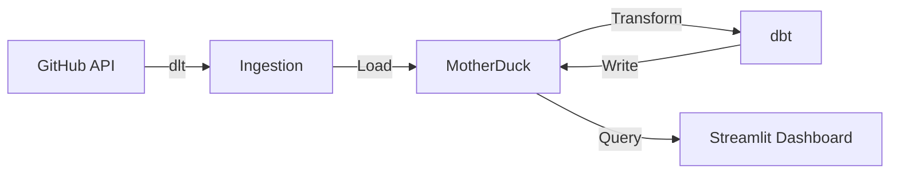
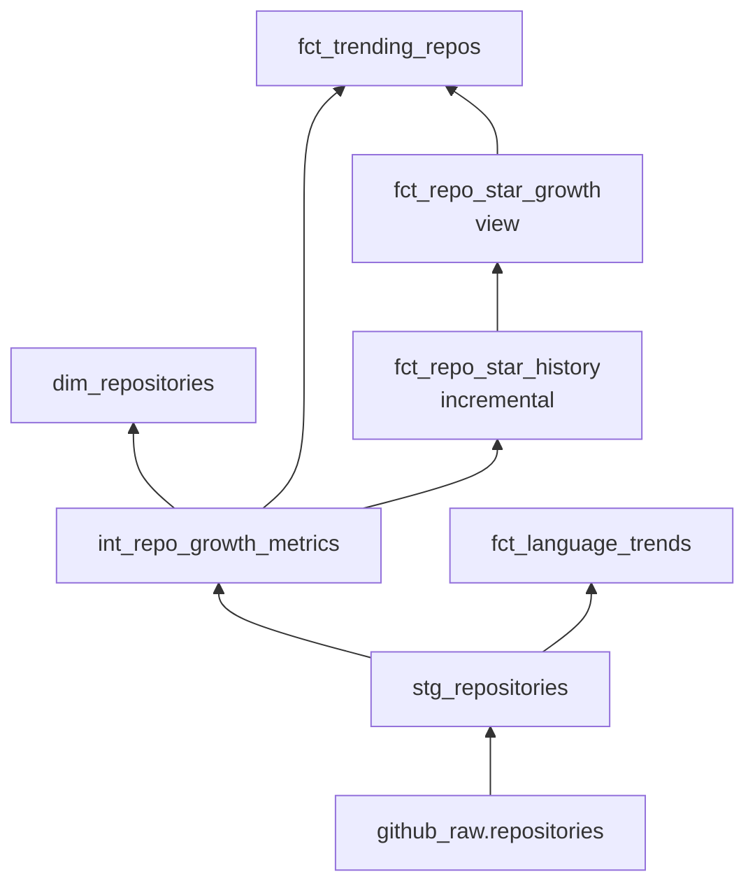
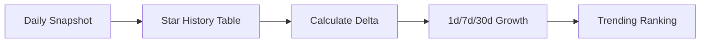

# AGENTS.md - Kimi Code Agent Instructions

This file provides persistent instructions for Kimi Code when working on this project.

## Project Overview

**GitHub AI Trend Tracker** - A data pipeline that tracks AI/ML open source trends from GitHub.

## Architecture



## Tech Stack

| Layer | Technology |
|-------|-----------|
| Ingestion | Python, dlt, requests |
| Database | MotherDuck (DuckDB) |
| Transform | dbt-core, dbt-duckdb |
| Dashboard | Streamlit, Plotly |
| Orchestration | GitHub Actions |

## Key Commands

```bash
# Run ingestion
python -c "from pipelines.github_ai_repos import run_pipeline, AI_QUERIES; run_pipeline(destination='motherduck', queries=AI_QUERIES, max_repos_per_query=100, min_stars=10)"

# Run dbt
cd dbt && dbt deps && dbt build --target prod

# Run dashboard locally (with .env loaded)
cd dashboard && ./run_local.sh

# Or manually (requires MOTHERDUCK_TOKEN env var)
export MOTHERDUCK_TOKEN=your_token_here
streamlit run streamlit_app.py
```

## Environment Variables

Required in `.env` or GitHub Secrets:
- `GH_TOKEN` - GitHub Personal Access Token
- `MOTHERDUCK_TOKEN` - MotherDuck JWT token

## Code Style

- Python: PEP 8, type hints preferred
- SQL: dbt style, lowercase, snake_case
- Use f-strings for formatting
- Prefer explicit over implicit

## File Organization

```
.
├── .github/workflows/    # CI/CD
├── dbt/                  # dbt models
│   ├── models/
│   │   ├── staging/
│   │   ├── intermediate/
│   │   └── marts/
│   │       ├── core/
│   │       └── metrics/
│   └── profiles.yml
├── dashboard/            # Streamlit app
│   └── streamlit_app.py
├── pipelines/            # Data ingestion
│   └── github_ai_repos.py
└── requirements.txt      # Dependencies
```

## dbt Model DAG



## Common Tasks

### Adding new data source
1. Add query to `AI_QUERIES` in `pipelines/github_ai_repos.py`
2. Run ingestion to test
3. Update dbt models if needed

### Adding dashboard widget
1. Edit `dashboard/streamlit_app.py`
2. Use `st.cache_data` for queries
3. Test locally before pushing

### Debugging pipeline
1. Check `github_raw.repositories` count
2. Verify `MOTHERDUCK_TOKEN` is set
3. Run with smaller query subset

## Notes

- MotherDuck database: `github_ai_analytics`
- GitHub API rate limit: 30 req/min (authenticated)
- Pipeline runs daily at 2 AM UTC
- Streamlit Cloud auto-redeploys on data update

## ⭐ Star Tracking Feature

The dashboard shows **actual** daily star growth instead of lifetime averages.

### How It Works



1. **Daily Snapshots** (`fct_repo_star_history`)
   - Incremental table that captures star count for each repo daily
   - Calculates `stars_gained_1d` (actual stars gained yesterday)

2. **Growth Metrics** (`fct_repo_star_growth`)
   - View that calculates growth over multiple periods:
     - `stars_gained_1d`: Stars gained yesterday (actual)
     - `stars_gained_7d`: Stars gained in last 7 days
     - `stars_gained_30d`: Stars gained in last 30 days

3. **Trending Ranking** (`fct_trending_repos`)
   - Now ranks by actual 1-day growth (`stars_gained_1d`)
   - Falls back to lifetime average if snapshot data unavailable

### Models

| Model | Type | Purpose |
|-------|------|---------|
| `fct_repo_star_history` | Incremental | Daily star count snapshots |
| `fct_repo_star_growth` | View | Calculated growth metrics |
| `fct_trending_repos` | Table | Trending repos with actual velocity |

### Running Locally

To populate star history data:

```bash
# 1. Run the pipeline (creates source data)
source venv/bin/activate
python -c "from pipelines.github_ai_repos import run_pipeline; run_pipeline(destination='motherduck')"

# 2. Run dbt models (creates star history)
cd dbt
dbt run

# 3. Dashboard will now show actual daily growth
cd ../dashboard
streamlit run streamlit_app.py
```
