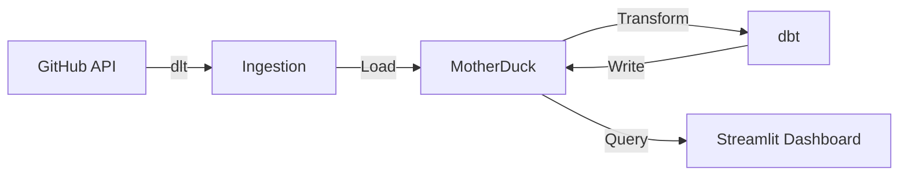
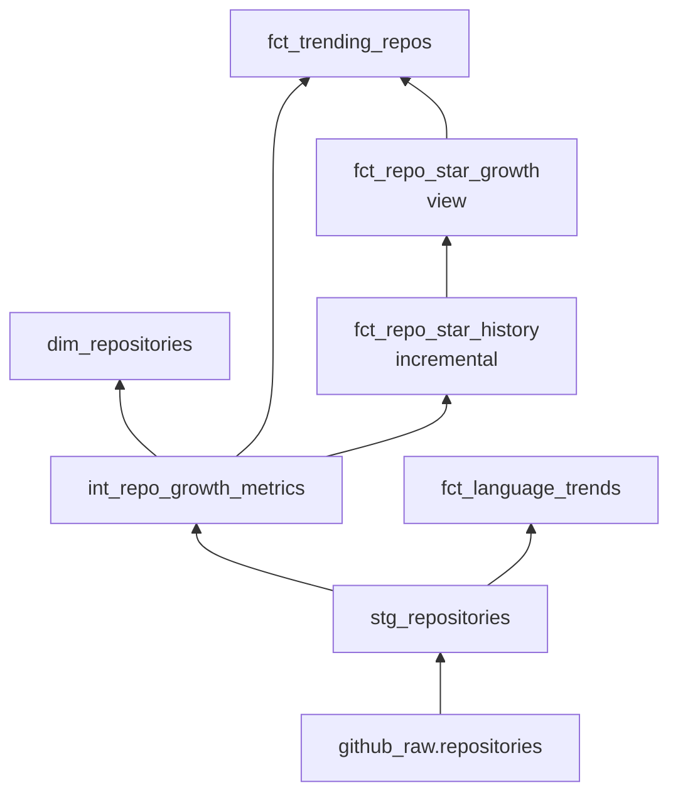

# AGENTS.md — Agent Instructions for this Project

This file provides persistent instructions for AI coding agents (Kimi Code, Claude Code, etc.) when working on this project.

## Project Overview

**GitHub AI Trend Tracker** — A data pipeline that tracks AI/ML open source trends from GitHub, transforms data with dbt, and visualizes it in a Streamlit dashboard.

- **Live dashboard**: https://gh-ai-trend-tracker.streamlit.app/

## Architecture



| Layer | Technology | Purpose |
|-------|-----------|---------|
| Ingestion | dlt + requests | Extract repos from GitHub Search API |
| Database | MotherDuck (cloud DuckDB) | Cloud data warehouse |
| Transform | dbt-core + dbt-duckdb | Clean & model data |
| Dashboard | Streamlit + Plotly | Interactive visualization |
| Orchestration | GitHub Actions | Daily scheduled runs (2 AM UTC) |

## File Organization

```
.
├── pipelines/
│   └── github_ai_repos.py    # GitHub API ingestion (dlt source/resources)
├── dbt/
│   ├── models/
│   │   ├── staging/           # stg_repositories
│   │   ├── intermediate/      # int_repo_growth_metrics
│   │   └── marts/
│   │       ├── core/          # dim_repositories
│   │       └── metrics/       # fct_language_trends, fct_trending_repos, fct_repo_star_*
│   ├── profiles.yml           # DB connection (dev=local DuckDB, prod=MotherDuck)
│   └── dbt_project.yml
├── dashboard/
│   └── streamlit_app.py       # Main Streamlit app
├── tests/                     # pytest test suite
├── .github/workflows/
│   ├── daily-ingestion.yml    # Daily pipeline + dbt build
│   └── ci.yml                 # PR quality gate (lint, test)
├── requirements.txt           # Python dependencies
├── pyproject.toml             # pytest, black, ruff config
└── Makefile                   # Dev commands
```

## Key Commands

```bash
# Setup
make setup                     # pip install + dbt deps

# Pipeline
make pipeline                  # Run ingestion locally (DuckDB)
python pipelines/github_ai_repos.py  # Same, direct

# dbt
make dbt-build                 # dbt build --target dev
make dbt-build-prod            # dbt build --target prod
make dbt-test                  # dbt test
cd dbt && dbt run --target dev # Run models only

# Dashboard
make dashboard                 # streamlit run dashboard/streamlit_app.py

# Quality
make test                      # pytest tests/ -v
make lint                      # ruff check
make format                    # black + ruff format

# Cleanup
make clean                     # Remove generated files
```

## Environment Variables

Required in `.env` or GitHub Secrets:

| Variable | Purpose | How to get |
|----------|---------|-----------|
| `GH_TOKEN` | GitHub API auth (30 req/min) | GitHub → Settings → Tokens (`public_repo` scope) |
| `MOTHERDUCK_TOKEN` | MotherDuck DB access | app.motherduck.com → Settings → Tokens |

## Code Style

- **Python**: PEP 8, type hints preferred, f-strings for formatting
- **SQL (dbt)**: lowercase, snake_case, dbt style guide
- **Formatting**: black (line-length 88), ruff for linting
- **Imports**: stdlib → third-party → local (ruff enforces)

## Data Flow

### Ingestion (dlt)

`pipelines/github_ai_repos.py` searches GitHub API for ~40 AI-related queries
(e.g. "llm", "pytorch", "langchain") and writes to a single source table:

```
github_raw.repositories  — one row per repo, merge on `id`
```

This is the ONLY table dlt writes. Everything below is dbt.

### dbt Model DAG



```
github_raw.repositories          <-- raw source (dlt writes here)
        │
        ▼
stg_repositories (view)          <-- RENAME + CLEAN
│  Renames: owner__login → owner, stargazers_count → stars_count
│  Calculates: repo_age_days, stars_per_day (lifetime avg)
│  No filtering — 1:1 with source
        │
        ▼
int_repo_growth_metrics (view)   <-- ENRICH + FILTER + CLASSIFY (central hub)
│  FILTERS OUT forks and archived repos
│  Adds: popularity_tier, activity_status, ai_category
│  Adds: star_to_fork_ratio, days_since_last_push
│  Most mart tables read from here
        │
        ├──▶ dim_repositories (table)
        │      Pass-through with dbt_loaded_at timestamp
        │      Dashboard: "Browse All" tab
        │
        ├──▶ fct_language_trends (table)
        │      GROUP BY language → repo_count, total_stars, avg_stars,
        │      top_5_repos, pct_of_total, language_rank
        │      Dashboard: "Languages" tab
        │
        ├──▶ fct_repo_star_history (incremental table)
        │  │   Daily snapshot of star counts per repo
        │  │   Compares today vs yesterday → stars_gained_1d
        │  │   unique_key: [repo_id, snapshot_date]
        │  │
        │  ▼
        │  fct_repo_star_growth (view)
        │  │   Joins 3 snapshots: today, 7d ago, 30d ago
        │  │   Outputs: stars_gained_1d/7d/30d, avg_daily_stars_7d/30d
        │  │
        │  ▼
        └──▶ fct_trending_repos (table)
               Joins int_repo_growth_metrics + fct_repo_star_growth
               Adds: rank_in_category, rank_by_velocity (1-day growth)
               Dashboard: "Trending" tab (sorted by stars_per_day)
```

### What the Dashboard Reads

| Dashboard Section | Table | Key Columns |
|---|---|---|
| Header metrics | `github_raw.repositories` | Raw counts (includes forks/archived) |
| "Trending" tab | `prod_marts.fct_trending_repos` | stars_gained_1d, stars_per_day |
| "Languages" tab | `prod_marts.fct_language_trends` | language, repo_count, total_stars |
| "Browse All" tab | `prod_marts.dim_repositories` | stars_count, activity_status |

### MotherDuck Schemas

| Schema | Contains |
|---|---|
| `github_raw` | 1 table: `repositories` (dlt source) |
| `prod_staging` | 1 view: `stg_repositories` |
| `prod_intermediate` | 1 view: `int_repo_growth_metrics` |
| `prod_marts` | 5 models: `dim_repositories`, `fct_language_trends`, `fct_repo_star_history`, `fct_repo_star_growth`, `fct_trending_repos` |

### Naming Conventions

- `stg_` = staging, `int_` = intermediate, `dim_` = dimension, `fct_` = fact
- **Database**: `github_ai_analytics`

## Common Development Tasks

### Adding a new AI search query
1. Add query string to `AI_QUERIES` list in `pipelines/github_ai_repos.py`
2. Run pipeline to test: `make pipeline`

### Adding a dashboard widget
1. Edit `dashboard/streamlit_app.py`
2. Use `@st.cache_data(ttl=300)` for any new queries
3. Test locally: `make dashboard`

### Adding a dbt model
1. Create SQL file in appropriate `dbt/models/` subdirectory
2. Add to `dbt_project.yml` if custom materialization needed
3. Run: `cd dbt && dbt run --select model_name`

### Running the full pipeline (local)
```bash
source venv/bin/activate
python -c "from pipelines.github_ai_repos import run_pipeline; run_pipeline(destination='duckdb')"
cd dbt && dbt build --target dev
```

### Debugging pipeline
1. Check `github_raw.repositories` count in MotherDuck
2. Verify `MOTHERDUCK_TOKEN` is set
3. Run with smaller query subset

## Testing

- Tests live in `tests/` — run with `make test`
- Pipeline tests mock GitHub API responses (no real API calls)
- Dashboard tests mock the DuckDB connection
- Minimum coverage target: 80%

## GitHub Actions

- **daily-ingestion.yml**: Runs daily at 2 AM UTC — ingests data + dbt build (prod)
- **ci.yml**: Runs on PRs — lint, format check, pytest

## Repo → Linear Mapping

- GitHub repo: `teguharia172/github-ai-trend-tracker`
- Linear team: **GHtrend** (key: `GHT`)
- Linear project: **GH Trend Tracker**
