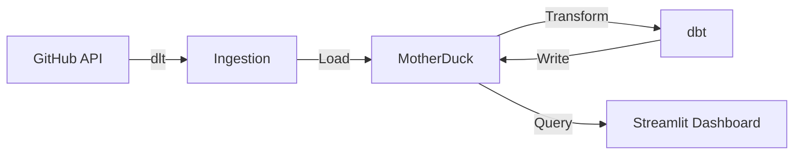
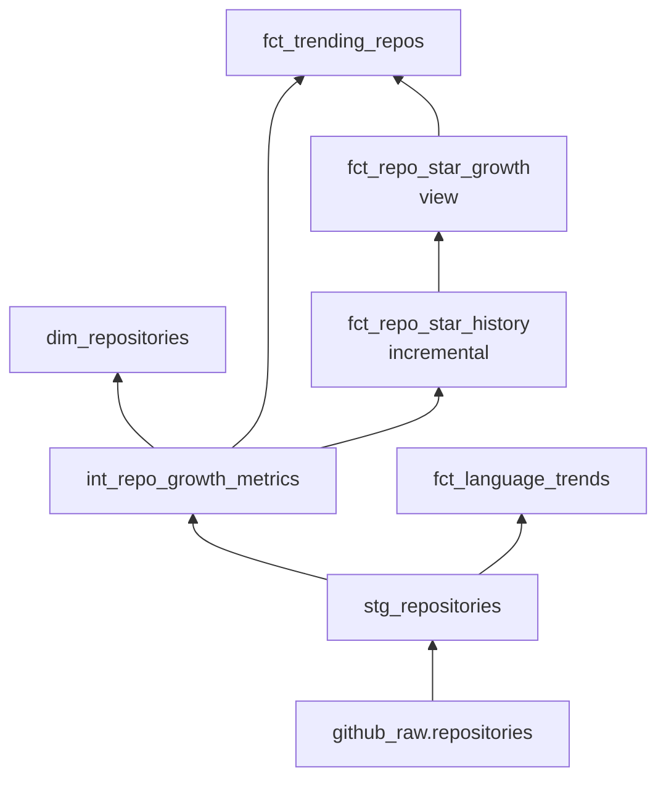

# AGENTS.md — Agent Instructions for this Project

This file provides persistent instructions for AI coding agents (Kimi Code, Claude Code, etc.) when working on this project.

> **For Agents:** Read this file completely before making any changes. When in doubt, ask the user rather than assume.

---

## 🚀 Quick Start for New Agents

**First 5 minutes on this project:**

1. **Read this file** (AGENTS.md) — You're doing it! ✅
2. **Check the README.md** — For human-facing project overview
3. **Understand the context** — What layer are you working on?
   - `pipeline/` → Data ingestion (dlt, GitHub API)
   - `dbt/` → Data transformation (SQL, models)
   - `dashboard/` → Streamlit app (Python, visualization)
   - `.github/workflows/` → CI/CD automation
4. **Run the tests** — `make test` to verify everything works
5. **Make your change** — Follow conventions below

**Before submitting any change:**
- [ ] Run `make test` — All tests pass
- [ ] Run `make lint` — No lint errors
- [ ] Follow commit convention: `type(scope): description` (e.g., `fix(dashboard): handle NaN in star count`)
- [ ] Reference Linear issue in commit: `Refs: GHT-XX`

---

## 🤔 When to Ask vs. When to Act

| Scenario | Action | Example |
|----------|--------|---------|
| Clear bug with stack trace | **Act** — Fix it | Dashboard crashes with `KeyError: 'stars_count'` |
| Feature request with acceptance criteria | **Act** — Implement | Add new filter to Browse All tab |
| Unclear requirements | **Ask** — Clarify first | "Make dashboard better" (too vague) |
| Database schema change | **Ask** — Confirm impact | Adding new column to `fct_trending_repos` |
| Changes to CI/CD or secrets | **Ask** — Security sensitive | Modifying GitHub Actions workflows |
| Refactoring core pipeline logic | **Ask** — Verify approach | Changing how dlt merges repos |
| Performance optimization | **Act** — But measure first | Slow query in dashboard |

**Rule of thumb:** If the change affects multiple layers (pipeline → dbt → dashboard) or involves data integrity, ask first.

---

## Project Overview

**GitHub AI Trend Tracker** — A data pipeline that tracks AI/ML open source trends from GitHub, transforms data with dbt, and visualizes it in a Streamlit dashboard.

- **Live dashboard**: https://gh-ai-trend-tracker.streamlit.app/

## Architecture



| Layer | Technology | Purpose |
|-------|-----------|---------|
| Ingestion | dlt + requests | Extract repos from GitHub Search API |
| Database | MotherDuck (cloud DuckDB) | Cloud data warehouse |
| Transform | dbt-core + dbt-duckdb | Clean & model data |
| Dashboard | Streamlit + Plotly | Interactive visualization |
| Orchestration | GitHub Actions | Daily scheduled runs (2 AM UTC) |

## File Organization

```
.
├── pipelines/
│   └── github_ai_repos.py    # GitHub API ingestion (dlt source/resources)
├── dbt/
│   ├── models/
│   │   ├── staging/           # stg_repositories
│   │   ├── intermediate/      # int_repo_growth_metrics
│   │   └── marts/
│   │       ├── core/          # dim_repositories
│   │       └── metrics/       # fct_language_trends, fct_trending_repos, fct_repo_star_*
│   ├── profiles.yml           # DB connection (dev=local DuckDB, prod=MotherDuck)
│   └── dbt_project.yml
├── dashboard/
│   └── streamlit_app.py       # Main Streamlit app
├── tests/                     # pytest test suite
├── .github/workflows/
│   ├── daily-ingestion.yml    # Daily pipeline + dbt build
│   └── ci.yml                 # PR quality gate (lint, test)
├── requirements.txt           # Python dependencies
├── pyproject.toml             # pytest, black, ruff config
└── Makefile                   # Dev commands
```

## Key Commands

```bash
# Setup
make setup                     # pip install + dbt deps

# Pipeline
make pipeline                  # Run ingestion locally (DuckDB)
python pipelines/github_ai_repos.py  # Same, direct

# dbt
make dbt-build                 # dbt build --target dev
make dbt-build-prod            # dbt build --target prod
make dbt-test                  # dbt test
cd dbt && dbt run --target dev # Run models only

# Dashboard
make dashboard                 # streamlit run dashboard/streamlit_app.py

# Quality
make test                      # pytest tests/ -v
make lint                      # ruff check
make format                    # black + ruff format

# Cleanup
make clean                     # Remove generated files
```

## Environment Variables

Required in `.env` or GitHub Secrets:

| Variable | Purpose | How to get |
|----------|---------|-----------|
| `GH_TOKEN` | GitHub API auth (30 req/min) | GitHub → Settings → Tokens (`public_repo` scope) |
| `MOTHERDUCK_TOKEN` | MotherDuck DB access | app.motherduck.com → Settings → Tokens |

## Code Style

- **Python**: PEP 8, type hints preferred, f-strings for formatting
- **SQL (dbt)**: lowercase, snake_case, dbt style guide
- **Formatting**: black (line-length 88), ruff for linting
- **Imports**: stdlib → third-party → local (ruff enforces)

## Data Flow

### Ingestion (dlt)

`pipelines/github_ai_repos.py` searches GitHub API for ~40 AI-related queries
(e.g. "llm", "pytorch", "langchain") and writes to a single source table:

```
github_raw.repositories  — one row per repo, merge on `id`
```

This is the ONLY table dlt writes. Everything below is dbt.

### dbt Model DAG



```
github_raw.repositories          <-- raw source (dlt writes here)
        │
        ▼
stg_repositories (view)          <-- RENAME + CLEAN
│  Renames: owner__login → owner, stargazers_count → stars_count
│  Calculates: repo_age_days, stars_per_day (lifetime avg)
│  No filtering — 1:1 with source
        │
        ▼
int_repo_growth_metrics (view)   <-- ENRICH + FILTER + CLASSIFY (central hub)
│  FILTERS OUT forks and archived repos
│  Adds: popularity_tier, activity_status, ai_category
│  Adds: star_to_fork_ratio, days_since_last_push
│  Most mart tables read from here
        │
        ├──▶ dim_repositories (table)
        │      Pass-through with dbt_loaded_at timestamp
        │      Dashboard: "Browse All" tab
        │
        ├──▶ fct_language_trends (table)
        │      GROUP BY language → repo_count, total_stars, avg_stars,
        │      top_5_repos, pct_of_total, language_rank
        │      Dashboard: "Languages" tab
        │
        ├──▶ fct_repo_star_history (incremental table)
        │  │   Daily snapshot of star counts per repo
        │  │   Compares today vs yesterday → stars_gained_1d
        │  │   unique_key: [repo_id, snapshot_date]
        │  │
        │  ▼
        │  fct_repo_star_growth (view)
        │  │   Joins 3 snapshots: today, 7d ago, 30d ago
        │  │   Outputs: stars_gained_1d/7d/30d, avg_daily_stars_7d/30d
        │  │
        │  ▼
        └──▶ fct_trending_repos (table)
               Joins int_repo_growth_metrics + fct_repo_star_growth
               Adds: rank_in_category, rank_by_velocity (1-day growth)
               Dashboard: "Trending" tab (sorted by stars_per_day)
```

### What the Dashboard Reads

| Dashboard Section | Table | Key Columns |
|---|---|---|
| Header metrics | `github_raw.repositories` | Raw counts (includes forks/archived) |
| "Trending" tab | `prod_marts.fct_trending_repos` | stars_gained_1d, stars_per_day |
| "Languages" tab | `prod_marts.fct_language_trends` | language, repo_count, total_stars |
| "Browse All" tab | `prod_marts.dim_repositories` | stars_count, activity_status |

### MotherDuck Schemas

| Schema | Contains |
|---|---|
| `github_raw` | 1 table: `repositories` (dlt source) |
| `prod_staging` | 1 view: `stg_repositories` |
| `prod_intermediate` | 1 view: `int_repo_growth_metrics` |
| `prod_marts` | 5 models: `dim_repositories`, `fct_language_trends`, `fct_repo_star_history`, `fct_repo_star_growth`, `fct_trending_repos` |

### Naming Conventions

- `stg_` = staging, `int_` = intermediate, `dim_` = dimension, `fct_` = fact
- **Database**: `github_ai_analytics`

## Common Development Tasks

### Adding a new AI search query
1. Add query string to `AI_QUERIES` list in `pipelines/github_ai_repos.py`
2. Run pipeline to test: `make pipeline`

### Adding a dashboard widget
1. Edit `dashboard/streamlit_app.py`
2. Use `@st.cache_data(ttl=300)` for any new queries
3. Test locally: `make dashboard`

### Adding a dbt model
1. Create SQL file in appropriate `dbt/models/` subdirectory
2. Add to `dbt_project.yml` if custom materialization needed
3. Run: `cd dbt && dbt run --select model_name`

### Running the full pipeline (local)
```bash
source venv/bin/activate
python -c "from pipelines.github_ai_repos import run_pipeline; run_pipeline(destination='duckdb')"
cd dbt && dbt build --target dev
```

### Debugging pipeline
1. Check `github_raw.repositories` count in MotherDuck
2. Verify `MOTHERDUCK_TOKEN` is set
3. Run with smaller query subset

## Testing

- Tests live in `tests/` — run with `make test`
- Pipeline tests mock GitHub API responses (no real API calls)
- Dashboard tests mock the DuckDB connection
- Minimum coverage target: 80%

## GitHub Actions

- **daily-ingestion.yml**: Runs daily at 2 AM UTC — ingests data + dbt build (prod)
- **ci.yml**: Runs on PRs — lint, format check, pytest

## Repo → Linear Mapping

- GitHub repo: `teguharia172/github-ai-trend-tracker`
- Linear team: **GHtrend** (key: `GHT`)
- Linear project: **GH Trend Tracker**

---

## Workflow Standards

### Commit Message Convention (Conventional Commits)

Format: **`type(scope): short description`**

```
feat(dashboard): add sparkline chart for trending repos
^    ^           ^
│    │           └─ imperative, lowercase, no period, max 72 chars
│    └─ scope (optional but recommended)
└─ type (required)
```

**Allowed types:**

| Type | When to use |
|------|------------|
| `feat` | New feature or capability |
| `fix` | Bug fix |
| `chore` | Maintenance, deps, config (no production logic change) |
| `docs` | Documentation only |
| `refactor` | Code restructure, no behavior change |
| `test` | Add or update tests |
| `ci` | GitHub Actions / CI changes |
| `perf` | Performance improvement |

**Allowed scopes:**

`pipeline` · `dbt` · `dashboard` · `infra` · `tests` · `docs`

**Linear issue reference (footer):**

```
feat(dashboard): add sparkline chart for trending repos

Add a sparkline to fct_trending_repos card showing 7-day star velocity.

Refs: GHT-42
```

> Rules enforced by `.commitlintrc.json`. See `.github/commit_convention.md` for full examples.

---

### Branch Naming Convention

Pattern: **`{type}/{LINEAR-ID}-{short-description}`**

```
feat/GHT-42-add-sparkline-chart
fix/GHT-17-fix-null-star-count
chore/GHT-55-upgrade-dlt-version
docs/GHT-8-update-dbt-model-docs
refactor/GHT-31-simplify-ingestion-retry
test/GHT-19-add-pipeline-unit-tests
ci/GHT-60-add-branch-name-lint
```

**Rules:**
- Type must match a valid commit type (above)
- LINEAR-ID is required — always link to a Linear issue
- Description is lowercase, hyphen-separated, max 50 chars
- No slashes inside the description segment

**Linear tip:** In Linear → Settings → Teams → GHtrend → Branch name template, set: `{type}/{issueIdentifier}-{issueTitle}` to auto-generate compliant branch names via the "Copy branch name" button on any issue.

---

### Linear ↔ GitHub Automation

The workflow `.github/workflows/linear-sync.yml` automatically:
1. **Moves the Linear issue to "In Progress"** when a branch matching `GHT-XXX` is pushed
2. **Posts a comment** on the issue with the commit SHA, author, message, and GitHub link

**Required secret:** Add `LINEAR_API_KEY` to GitHub repo → Settings → Secrets and variables → Actions.
Get the key from: Linear → Settings → API → Personal API keys.

---

### Linear Issue Templates

Four PM-quality issue templates live in `.linear/`. Copy them into Linear via:
**Linear → Settings → Teams → GHtrend → Templates → New template**

| Template | File | Use for |
|----------|------|---------|
| 🐛 Bug | `.linear/bug.md` | Unexpected behavior, errors, regressions |
| ✨ Feature | `.linear/feature.md` | New user-facing capability |
| 🔧 Chore | `.linear/chore.md` | Tech debt, deps, config, non-feature work |
| 📈 Improvement | `.linear/improvement.md` | Enhancing existing functionality |

---

## 📁 File-Specific Guidance

**When working on... read these files first:**

| Task | Read First | Then Check |
|------|------------|------------|
| Pipeline ingestion | `pipelines/github_ai_repos.py` | `tests/test_pipeline.py` |
| dbt models | `dbt/models/` structure | `dbt/models/intermediate/int_repo_growth_metrics.sql` (central hub) |
| Dashboard changes | `dashboard/streamlit_app.py` | `tests/test_dashboard.py` |
| New dbt model | `dbt/dbt_project.yml` | Similar existing models |
| CI/CD changes | `.github/workflows/ci.yml` | `.github/workflows/daily-ingestion.yml` |
| Environment setup | `.env.example` | `requirements.txt` |

**Key architectural constraints:**
- **dlt writes ONLY to `github_raw.repositories`** — Never modify this table directly
- **All transformations go through dbt** — Add models, don't modify raw data
- **Dashboard queries MotherDuck** — Use `@st.cache_data(ttl=300)` for all queries
- **Tests mock external APIs** — Don't make real GitHub API calls in tests

---

## 🛠️ Troubleshooting Common Issues

| Symptom | Likely Cause | Fix |
|---------|--------------|-----|
| `ModuleNotFoundError` | Not in venv or deps not installed | `source venv/bin/activate && pip install -r requirements.txt` |
| `dbt not found` | dbt not installed or not in PATH | `pip install dbt-core dbt-duckdb && cd dbt && dbt deps` |
| DuckDB connection fails | Wrong target or missing token | Check `.env` has `MOTHERDUCK_TOKEN` for prod, or use `dev` target |
| Dashboard crashes on Streamlit Cloud | `python-dotenv` import issue | Ensure `dotenv` is in `requirements.txt` and imported conditionally |
| dbt model fails | SQL syntax or missing refs | Run `dbt compile` to see generated SQL |
| Tests fail with mock errors | Mock not set up correctly | Check `tests/conftest.py` for fixtures |
| `make` command not found | Make not installed | Use direct commands (see Makefile contents) |

**Getting help:**
1. Check this AGENTS.md first
2. Look at similar existing code
3. Check tests for examples
4. Ask the user if still stuck

---

## 📋 Linear Workflow for Agents

**GHT = GitHub AI Trend Tracker project** (Linear team key: `GHtrend`)

### When Working on Any Task:

1. **At Start** — Update Linear issue to **"In Progress"**
   - Use `update_issue` with the issue ID
   - If status update fails, add a comment noting you've started

2. **During Work** — Add progress comments for significant milestones
   - Use `add_comment` with updates
   - Reference any blockers or questions

3. **At Completion** — Update Linear issue to **"Done"**
   - Add a summary comment of what was completed
   - Include commit message or PR link if applicable

### Linear Naming Conventions:

| Element | Format | Example |
|---------|--------|---------|
| Issue ID | `GHT-XX` | `GHT-17`, `GHT-42` |
| Branch name | `{type}/GHT-XX-{description}` | `feat/GHT-17-enhance-agents-md` |
| Commit reference | `Refs: GHT-XX` in footer | `Refs: GHT-17` |

**Issue Types:**
- `feat` — New feature
- `fix` — Bug fix
- `chore` — Maintenance, deps, config
- `docs` — Documentation
- `refactor` — Code restructuring
- `test` — Tests
- `ci` — CI/CD changes

### Tool Calling Notes & Workarounds:

**Known Issues:**

| Tool | Issue | Workaround |
|------|-------|------------|
| `update_issue` (status) | May fail with "stateId must be a UUID" | Use `add_comment` to document status change instead; user can manually update |
| `update_issue` (complex) | Some parameter combinations fail | Update one field at a time, or use comments |
| `search_issues` | `milestone:` filter may not work | Search without filter, then manually filter results |

**Best Practices:**
- Always check tool results — don't assume success
- If a tool fails, try an alternative (e.g., comment instead of status update)
- Document tool failures in comments so user knows what happened

---

## 🤖 Agent-Specific Notes

### For Claude Code
- Use `ReadFile` with `line_offset` for large files
- Parallel tool calls are encouraged for efficiency
- Follow the project's Conventional Commits style strictly

### For Kimi Code
- Same conventions apply
- Use `Glob` and `Grep` to explore the codebase
- Update AGENTS.md if you find gaps

### For All Agents
- **Be concise** in responses — users prefer brevity
- **Make minimal changes** — Don't over-engineer
- **Test your changes** — Run relevant tests before finishing
- **Update docs** — If you change how something works, update AGENTS.md
- **Update Linear** — Follow the Linear workflow above for every task

---

## Agent Docs

`AGENTS.md` is the **single source of truth** for all AI coding agents.
`CLAUDE.md` redirects here and should not be edited.

**If you find this file is missing information or has errors, update it.** This is a living document.
