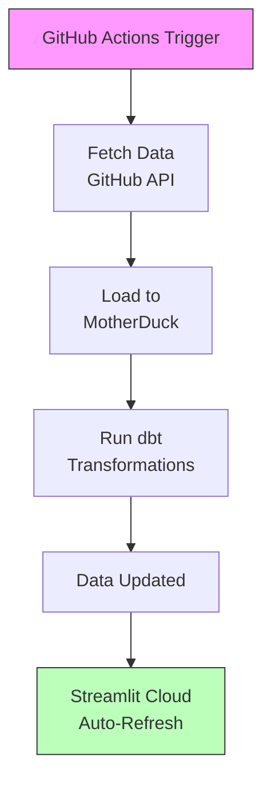
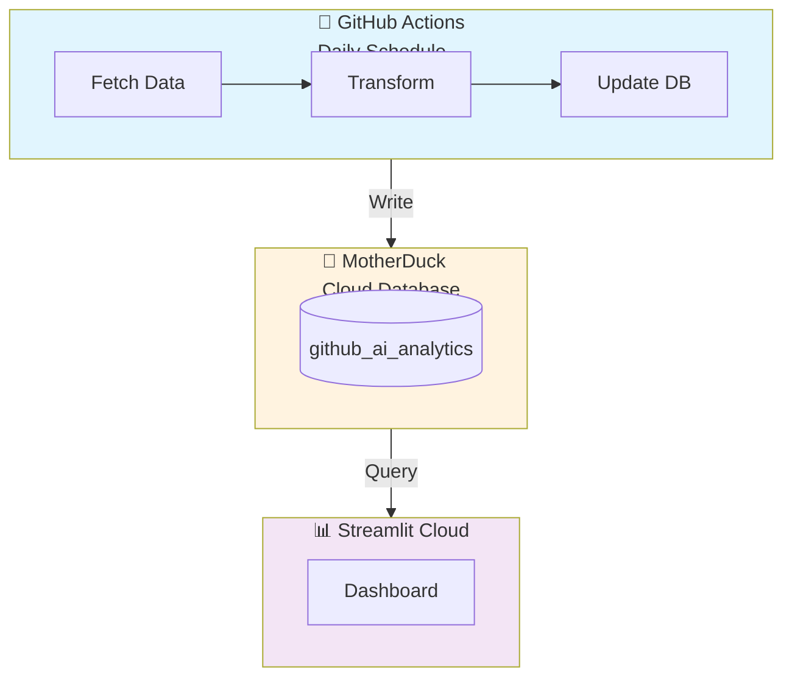

# 🚀 Deployment Guide

Deploy your GitHub AI Trend Tracker to run daily with free cloud services.

**Live Dashboard URL:** https://gh-ai-trend-tracker.streamlit.app/

---

## What Gets Deployed

| Component | Service | Purpose |
|-----------|---------|---------|
| Data Pipeline | GitHub Actions | Runs daily to fetch new data |
| Database | MotherDuck | Cloud storage for all data |
| Dashboard | Streamlit Cloud | Public-facing visualizations |

**Cost:** $0/month (all free tiers)

---

## Prerequisites

You need 2 accounts (both free):

1. **GitHub** - You already have this
2. **MotherDuck** - Sign up at https://app.motherduck.com/ (takes 2 minutes)

---

## Step 1: Get Your Tokens

### 1.1 MotherDuck Token

1. Go to https://app.motherduck.com/
2. Sign up with Google or GitHub
3. Click your profile (top right) → **Account Settings**
4. Copy the token (long string)

### 1.2 GitHub Token

1. Go to https://github.com/settings/tokens
2. Click **"Generate new token (classic)"**
3. Check only: `public_repo`
4. Click **Generate token**
5. Copy the token (starts with `ghp_`)

---

## Step 2: Add Secrets to GitHub

These tokens are stored securely in your repo:

1. Go to your repo → **Settings** → **Secrets and variables** → **Actions**
2. Click **"New repository secret"**
3. Add both:

| Secret Name | Value |
|-------------|-------|
| `GH_TOKEN` | Your GitHub token (ghp_xxx...) |
| `MOTHERDUCK_TOKEN` | Your MotherDuck token |

---

## Step 3: Connect to Streamlit Cloud

1. Go to https://share.streamlit.io
2. Sign in with GitHub
3. Click **"New app"**
4. Select your repository
5. Set **Main file path**: `dashboard/streamlit_app.py`
6. Add secret: `MOTHERDUCK_TOKEN` = your MotherDuck token
7. Click **Deploy**

---

## Step 4: Push Your Code

```bash
git add .
git commit -m "Deploy to cloud"
git push origin main
```

The workflow runs automatically. Wait about 5 minutes.

---

## Step 5: View Your Dashboard

Go to your Streamlit Cloud URL (shown in dashboard after deploy)

---

## How It Works

### Daily at 2 AM UTC:



### Manual Trigger:

You can run it anytime:
1. Go to **Actions** tab
2. Click **"Daily Data Ingestion"**
3. Click **"Run workflow"**

---

## Architecture



---

## Troubleshooting

### Workflow Fails

1. Go to **Actions** tab
2. Click the failed run (red X)
3. Read the error message

**Common fixes:**
- **"Rate limit exceeded"** → Wait 1 hour, GitHub limits reset
- **"Invalid token"** → Check secrets are correct in Settings
- **"Database connection failed"** → Verify MotherDuck token

### Dashboard Not Showing

1. Check the workflow completed (green checkmark)
2. Go to Streamlit Cloud dashboard
3. Check app logs for errors
4. Verify `MOTHERDUCK_TOKEN` is set in Streamlit secrets

### No Data in Dashboard

Test the database connection:
```bash
# Install DuckDB
brew install duckdb

# Connect to MotherDuck
duckdb "md:github_ai_analytics?motherduck_token=YOUR_TOKEN"

# Test query
SELECT COUNT(*) FROM prod_marts.dim_repositories;
```

---

## Files You Should Know

| File | Purpose |
|------|---------|
| `.github/workflows/daily-ingestion.yml` | Runs the daily pipeline |
| `pipelines/github_ai_repos.py` | Fetches data from GitHub |
| `dbt/profiles.yml` | Database connections |
| `dbt/models/marts/` | dbt transformation models |
| `dashboard/streamlit_app.py` | Streamlit dashboard app |
| `requirements.txt` | Python packages |

---

## Support

- **Issues:** https://github.com/YOUR_USERNAME/github-ai-trend-tracker/issues
- **MotherDuck Docs:** https://motherduck.com/docs/
- **Streamlit Docs:** https://docs.streamlit.io/

---

**You're done!** Your dashboard updates automatically every day. 🎉
