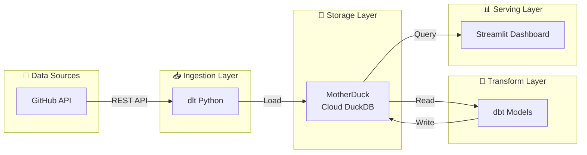
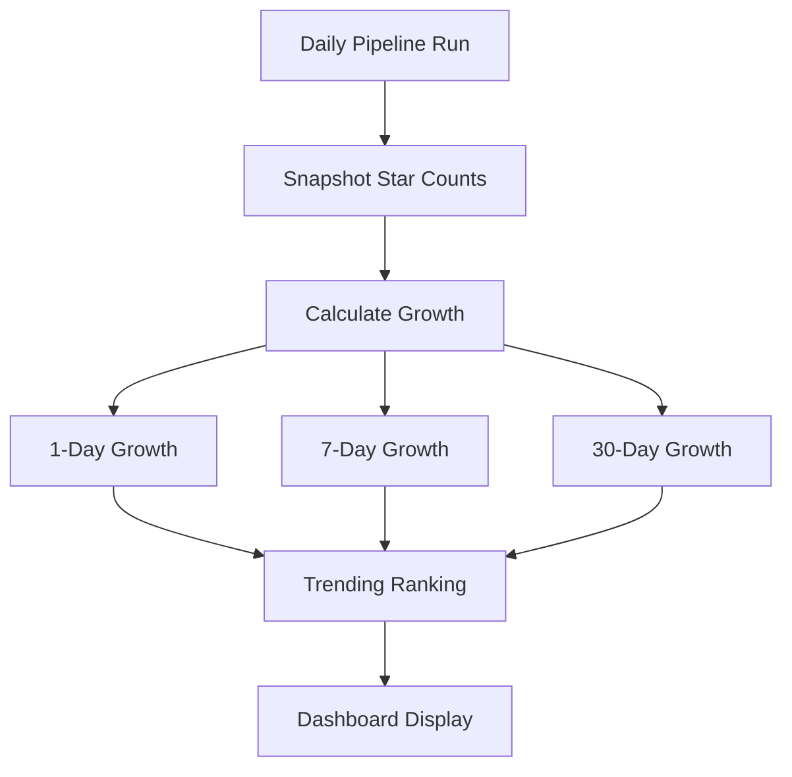
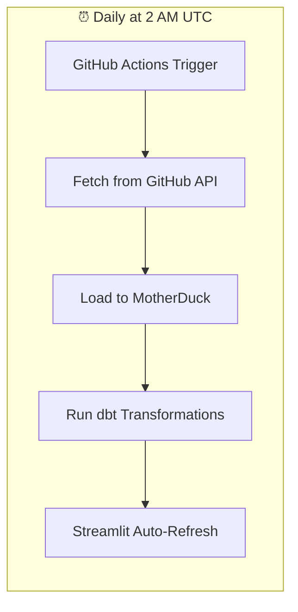
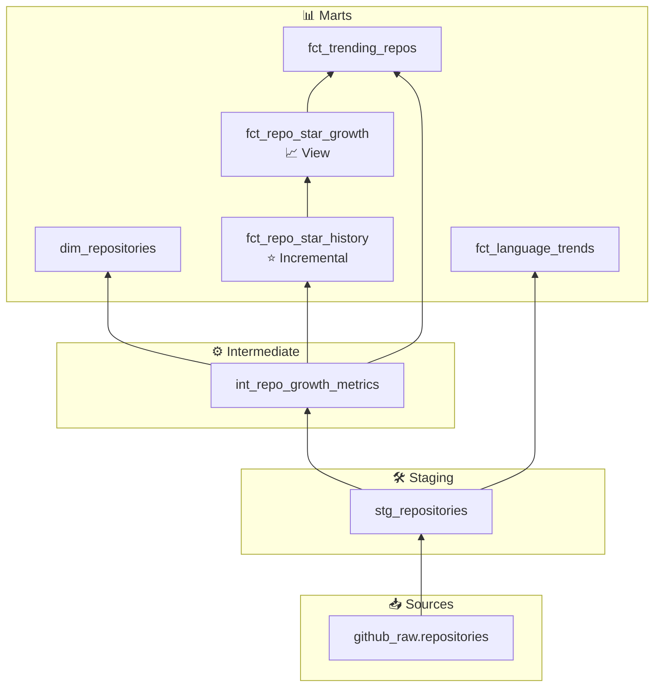

# 🚀 GitHub AI Trend Tracker

[](https://python.org)
[](https://getdbt.com)
[](https://streamlit.io)
[](https://motherduck.com)

A complete data pipeline that tracks AI/ML open source trends from GitHub, transforms the data with dbt, and visualizes it in a beautiful Streamlit dashboard.

**[View Live Dashboard](https://gh-ai-trend-tracker.streamlit.app/)**

## 🏗️ Architecture



| Component | Technology | Purpose |
|-----------|------------|---------|
| **Ingestion** | dlt + Python | Extract from GitHub API |
| **Database** | MotherDuck (DuckDB) | Cloud data warehouse |
| **Transform** | dbt | Clean & model data |
| **Dashboard** | Streamlit | Interactive visualization |
| **Orchestration** | GitHub Actions | Daily scheduled runs |

## 🚀 Quick Start

### 1. Clone & Setup

```bash
git clone https://github.com/teguharia172/github-ai-trend-tracker.git
cd github-ai-trend-tracker

# Create virtual environment
python -m venv venv
source venv/bin/activate  # Windows: venv\Scripts\activate

# Install dependencies
pip install -r requirements.txt
```

### 2. Configure Secrets

Create `.env` file:
```bash
GH_TOKEN=your_github_personal_access_token
MOTHERDUCK_TOKEN=your_motherduck_token
```

Get tokens:
- **GitHub Token**: https://github.com/settings/tokens (needs `public_repo` scope)
- **MotherDuck Token**: https://app.motherduck.com → Settings → Tokens

### 3. Run Pipeline Locally

```bash
# Ingest data
python -c "
from pipelines.github_ai_repos import run_pipeline, AI_QUERIES
run_pipeline(
    destination='motherduck',
    queries=AI_QUERIES,
    max_repos_per_query=100,
    min_stars=10
)
"

# Transform data
cd dbt
dbt deps
dbt build --target prod
cd ..

# Run dashboard
cd dashboard
streamlit run streamlit_app.py
```

Open http://localhost:8501

## 📊 Dashboard Features

- **🔥 Trending**: Top repositories by actual daily star velocity (not lifetime average)
- **📊 Analytics**: Language statistics and interactive charts
- **📋 Browse All**: Full repository list with filters (language, activity status, stars)
- **🎨 Clean UI**: Evidence-style minimalist white theme

## ⭐ Star Tracking Feature

The dashboard shows **actual** daily star growth instead of lifetime averages.



| Metric | Description |
|--------|-------------|
| `stars_gained_1d` | Actual stars gained yesterday |
| `stars_gained_7d` | Stars gained in last 7 days |
| `stars_gained_30d` | Stars gained in last 30 days |

## 📁 Repository Structure

```
.
├── .github/workflows/      # CI/CD automation
├── dbt/                    # dbt transformations
│   ├── models/             # SQL models (staging, intermediate, marts)
│   ├── profiles.yml        # DB connection
│   └── dbt_project.yml     # dbt configuration
├── dashboard/              # Streamlit dashboard
│   ├── streamlit_app.py    # Main app
│   └── requirements.txt    # Dashboard deps
├── pipelines/              # Data ingestion
│   └── github_ai_repos.py  # GitHub API pipeline
├── requirements.txt        # Main dependencies
├── README.md               # This file
├── AGENTS.md               # Developer guide
└── DEPLOYMENT.md           # Deployment guide
```

## 🔄 Automated Pipeline



The pipeline runs daily at 2 AM UTC via GitHub Actions:

1. **Ingest** → Fetches AI repos from GitHub Search API
2. **Transform** → dbt models clean & aggregate data
3. **Deploy** → Streamlit Cloud auto-updates on data refresh

## 🛠️ Tech Stack

| Layer | Tools |
|-------|-------|
| Ingestion | dlt, requests |
| Warehouse | MotherDuck (DuckDB) |
| Transform | dbt-core, dbt-duckdb |
| Dashboard | Streamlit, Plotly, Pandas |
| Orchestration | GitHub Actions |

## 🗄️ Data Models

### dbt Model Hierarchy



### Source Tables (raw)
| Table | Description |
|-------|-------------|
| `github_raw.repositories` → Fetched from GitHub Search API |

### Mart Tables (transformed)
| Table | Type | Purpose |
|-------|------|---------|
| `dim_repositories` | Dimension | Repository attributes & metadata |
| `fct_language_trends` | Fact | Language statistics & rankings |
| `fct_repo_star_history` | Incremental | Daily star count snapshots |
| `fct_repo_star_growth` | View | Calculated growth metrics (1d/7d/30d) |
| `fct_trending_repos` | Fact | Trending repos with actual velocity |

## 🌐 Deployment

### Streamlit Cloud (Recommended)
1. Push to GitHub
2. Connect repo at [share.streamlit.io](https://share.streamlit.io)
3. Add `MOTHERDUCK_TOKEN` secret in Streamlit Cloud dashboard
4. Deploy!

### GitHub Actions
Already configured in `.github/workflows/daily-ingestion.yml`

See [DEPLOYMENT.md](DEPLOYMENT.md) for detailed deployment instructions.

## 🤝 Contributing

Issues and PRs welcome!

## 📄 License

MIT License - see LICENSE file
